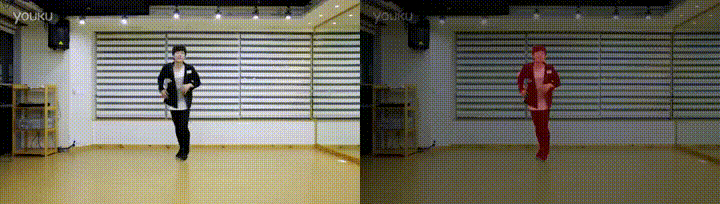

# MTMFI-VOS
*Learning video object segmentation with multi-level target models and feature integration*

## Notice  
the network is based on FRTM-VOS [[code]](https://github.com/andr345/frtm-vos) [[paper]](https://openaccess.thecvf.com/content_CVPR_2020/papers/Robinson_Learning_Fast_and_Robust_Target_Models_for_Video_Object_Segmentation_CVPR_2020_paper.pdf), which is proposed in "***Learning Fast and Robust Target Models for Video Object Segmentation***"(*CVPR2020*).

## Display

## Network Architecture  

## Requirments
* python 3.7.0
* PyTorch 1.6.0
* CUDA10.0 + cudnn7.6.4
* scipy scikit-image tqdm easydict opencv-python
  
## DataSets  

### DAVIS
goto [website](https://davischallenge.org/davis2017/code.html#semisupervised) to download datasets:  
**TrainVal**(480p) for train and validation, **Test-Dev 2017**(480p) for test

### YouTube-VOS
goto [website](https://drive.google.com/drive/folders/1bI5J1H3mxsIGo7Kp-pPZU8i6rnykOw7f) to download datasets and place it in this directory structure:

    /path/to/ytvos2018
    |-- train/
    |-- train_all_frames/
    |-- valid/
    |-- valid_all_frames/

### Alibaba media
this compeitition aims to segment the people in videos and doesn't supply the first annotations. Thus, we use PolarMask [[code]](https://github.com/xieenze/PolarMask) [[paper]](https://arxiv.org/pdf/1909.13226.pdf)to produce the masks of the first frame on each video.  
the test dataset is tidying, just wait:)
## Models  
| backbone | datasets | components | link |  
| :---: | :---: | :---: | :---: |  
| ResNet-101 | DAVIS | MTM | - |
| ResNet-101 | DAVIS+YouTube | MTM | [download](https://www.dropbox.com/s/tcsosmotc48euc3/resnet101_all_mtm.pth?dl=0) | 
| ResNet-101 | DAVIS | MTMFI | [download](https://www.dropbox.com/s/cr3rixvkdrb57xn/resnet101_dv_mtmfi.pth?dl=0) | 
| ResNet-101 | DAVIS+YouTube | MTMFI | - | 
## Evaluate
inference the video and evaluate the inference results  

    python evaluate.py --model <weight-name> --dset dv2016val --seg initial (--fast) --dev cuda:0
* `--model` is the name of the checkpoint to use in the `weights ` directory.
* `--dset` is one of   
  | Name | Description |
  | ---- | ---- |
  | dv2016val | DAVIS 2016 validation set |
  | dv2017val | DAVIS 2017 validation set |
  | yt2018jjval | the split of YouTubeVOS 2018 "train_all_frames" |
  | yt2018val | YouTubeVOS 2018 official "valid_all_frames" set |
* `--seg` has two mode: `initial`has only MTM, `bise` has both MTM and FI
* `--fast` reduces the number of optimizer iterations to  increase the speed
* `--dev` denotes GPU id
### - example
use model(only DAVIS) with MTM to evaluate DAVIS 2016 validation set in fast mode:  

    python evaluate.py --model  resnet101_dv_mtmfi.pth --dset dv2016val --seg initial --fast --dev cuda:0
use model(DAVIS+YouTube-VOS)  with MTMFI to evaluate YouTubeVOS 2018 official validation set in original mode:  

    python evaluate.py --model  resnet101_all_mtmfi.pth --dset dv2016test --seg bise --dev cuda:0

## Inference
just inference the video

    python inference.py --model <weight-name> --seg bise --dset dv2016val (--fast) --dev cuda:0
* `--model` is the name of the checkpoint to use in the `weights ` directory.
* `--dset` is one of   
  | Name | Description |
  | ---- | ---- |
  | dv2016test | DAVIS 2016 test-dev set |
  | dv2017test | DAVIS 2017 test-dev set |
  | ali2021test | Alibaba 2021 test set |
  | yt2018jjval | the split of YouTubeVOS 2018 "train_all_frames" |
  | yt2018val | YouTubeVOS 2018 official "valid_all_frames" set |
* `--seg` has two mode: `initial`has only MTM, `bise` has both MTM and FI
* `--fast` reduces the number of optimizer iterations to  increase the speed
* `--dev` denotes GPU id
  
### Specially for Alibaba DataSet
Alibaba's data set has a higher resolution and needs to be scaled to 480p first:

    python ali/resize.py
Then, test the video sets like:

    python inference.py --dev cuda:0 --dset ali2021val --seg bise --model resnet101_all_mtmfi.pth
Finally, restore the resolution:

    python ali/inverse_resize.py